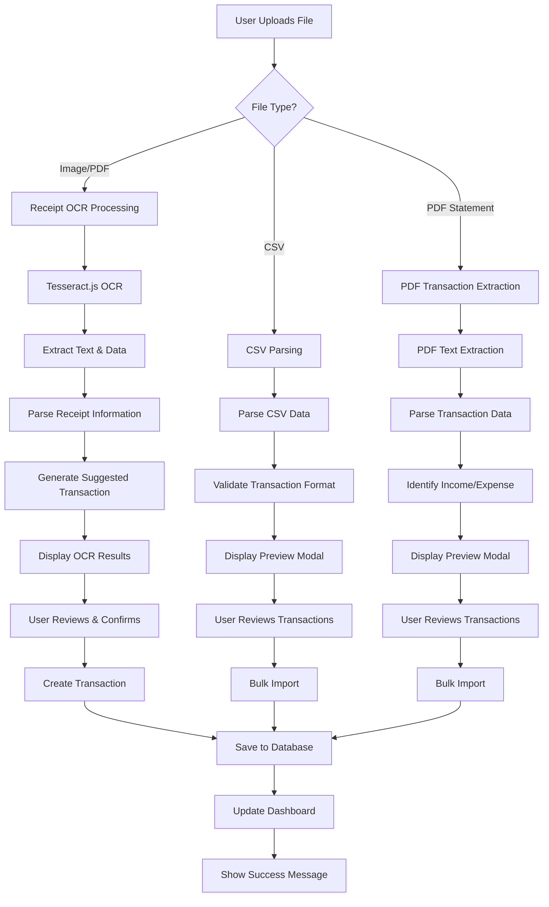

# Personal Finance Assistant - FinanceTracker

A full-stack MERN application designed to help users track, manage, and understand their financial activities. Users can log income and expenses, categorize transactions, view analytics with charts, and extract expenses from uploaded receipts using OCR technology.

## 🌟 Features

### Core Features
- ✅ **User Authentication** - Secure JWT-based login/signup system
- ✅ **Beautiful Homepage** - Modern landing page with feature showcase
- ✅ **Dashboard** - Financial overview with real-time statistics and enhanced UI
- ✅ **Transaction Management** - Add, edit, delete income/expense entries
- ✅ **Analytics & Charts** - Visual insights with expense categorization
- ✅ **Receipt OCR** - Extract data from uploaded receipt images/PDFs using Tesseract.js
- ✅ **CSV Import** - Bulk import transactions from bank statements and financial apps
- ✅ **PDF Import** - Import transaction history from PDF bank statements

### Additional Features
- 💰 Budget tracking and monitoring
- 📊 Monthly/yearly financial summaries
- 🏷️ Category-based expense tracking
- 📱 Responsive design for all devices
- 🔒 Bank-level security with data encryption
- 🎨 Modern UI with gradient designs and smooth animations

## 🛠️ Tech Stack

### Backend
- **Node.js** - Runtime environment
- **Express.js** - Web framework
- **MongoDB** - Database with Mongoose ODM
- **JWT** - Authentication tokens
- **Multer** - File upload handling
- **Tesseract.js** - OCR for receipt processing
- **PDF-Parse** - PDF text extraction
- **CSV-Parser** - CSV file processing
- **bcryptjs** - Password hashing

### Frontend
- **React** - UI library
- **React Bootstrap** - UI components
- **React Router** - Client-side routing
- **Axios** - HTTP client
- **Recharts** - Data visualization
- **React Toastify** - Notifications

## 🚀 Getting Started

### Prerequisites
- Node.js (v14 or higher)
- MongoDB (local or cloud instance)
- npm or yarn package manager

### Installation

1. **Clone the repository**
   ```bash
   git clone <repository-url>
   cd finance-tracker
   ```

2. **Setup Backend**
   ```bash
   cd backend
   npm install
   ```

3. **Setup Frontend**
   ```bash
   cd ../frontend
   npm install
   ```

4. **Environment Configuration**
   
   Create `backend/.env` file:
   ```env
   PORT=5000
   MONGODB_URI=mongodb://localhost:27017/finance-tracker
   JWT_SECRET=your-super-secret-jwt-key-change-this-in-production
   NODE_ENV=development
   ```

5. **Start MongoDB**
   ```bash
   # If using local MongoDB
   mongod
   ```

6. **Run the Application**
   
   Start Backend (Terminal 1):
   ```bash
   cd backend
   npm run dev
   ```
   
   Start Frontend (Terminal 2):
   ```bash
   cd frontend
   npm start
   ```

7. **Access the Application**
   - Frontend: http://localhost:3000
   - Backend API: http://localhost:5000

## 📁 Project Structure

```
finance-tracker/
├── backend/
│   ├── models/          # Database models
│   ├── routes/          # API routes
│   ├── middleware/      # Authentication & validation
│   ├── uploads/         # File upload directory
│   ├── utils/           # Utility functions
│   ├── .env             # Environment variables
│   ├── server.js        # Main server file
│   └── package.json     # Backend dependencies
├── frontend/
│   ├── public/          # Static files
│   ├── src/
│   │   ├── components/  # Reusable components
│   │   ├── pages/       # Page components
│   │   ├── contexts/    # React contexts
│   │   ├── hooks/       # Custom hooks
│   │   ├── utils/       # Utility functions
│   │   ├── App.js       # Main app component
│   │   └── index.js     # Entry point
│   └── package.json     # Frontend dependencies
└── README.md            # Project documentation
```

## 🔗 API Endpoints

### Authentication
- `POST /api/auth/register` - User registration
- `POST /api/auth/login` - User login
- `GET /api/auth/me` - Get current user
- `PUT /api/auth/profile` - Update user profile

### Transactions
- `GET /api/transactions` - Get user transactions (with filtering)
- `POST /api/transactions` - Create new transaction
- `GET /api/transactions/:id` - Get single transaction
- `PUT /api/transactions/:id` - Update transaction
- `DELETE /api/transactions/:id` - Delete transaction
- `GET /api/transactions/analytics/summary` - Get analytics data
- `GET /api/transactions/categories` - Get available categories

### File Upload & OCR
- `POST /api/upload/receipt` - Upload and process receipt (OCR)
- `POST /api/upload/csv` - Upload and parse CSV file for bulk import
- `POST /api/upload/transactions-pdf` - Import transactions from PDF
- `POST /api/upload/bulk-import` - Bulk import transactions

## 🎨 UI/UX Design

The application features a modern, clean design with:
- Beautiful gradient hero section with animated background
- Responsive Bootstrap components with custom styling
- Custom CSS variables for consistent theming
- Smooth animations and transitions
- Enhanced dashboard with improved visual hierarchy
- Modern upload interface with drag-and-drop functionality
- Gradient buttons and cards with hover effects
- Intuitive navigation and user flows

## 📊 OCR & Import Workflow



## 🔧 Development Status

### ✅ Completed
- [x] Project structure setup
- [x] Backend API with MongoDB
- [x] User authentication system
- [x] Frontend with React and Bootstrap
- [x] Beautiful homepage with modern design
- [x] Enhanced dashboard with improved UI
- [x] Protected routes and navigation
- [x] Transaction CRUD operations
- [x] Receipt OCR functionality with Tesseract.js
- [x] CSV import functionality
- [x] PDF transaction import
- [x] Modern CSS with gradients and animations
- [x] Responsive design for all devices

### 🚧 In Progress
- [ ] Advanced analytics with charts
- [ ] Budget alerts and notifications
- [ ] Data export functionality

### 📋 Planned Features
- [ ] Mobile app (React Native)
- [ ] Advanced reporting
- [ ] Multi-currency support
- [ ] Receipt image enhancement
- [ ] Machine learning for better OCR accuracy

## 🧪 Testing

```bash
# Backend tests
cd backend
npm test

# Frontend tests
cd frontend
npm test
```

## 🚀 Deployment

### Backend (Node.js)
- Configure production environment variables
- Set up MongoDB Atlas for cloud database
- Deploy to Heroku, Railway, or similar service

### Frontend (React)
- Build production bundle: `npm run build`
- Deploy to Netlify, Vercel, or serve with Express

## 🤝 Contributing

1. Fork the repository
2. Create a feature branch (`git checkout -b feature/amazing-feature`)
3. Commit your changes (`git commit -m 'Add some amazing feature'`)
4. Push to the branch (`git push origin feature/amazing-feature`)
5. Open a Pull Request

## 📄 License

This project is licensed under the MIT License - see the [LICENSE](LICENSE) file for details.

## 👥 Authors

- **Finance Tracker Team** - Initial work

## 🙏 Acknowledgments

- Bootstrap for the beautiful UI components
- React community for the amazing ecosystem
- MongoDB for the flexible database solution
- Tesseract.js for OCR capabilities
- All contributors and users of this application

---

**Happy Finance Tracking! 💰📊**