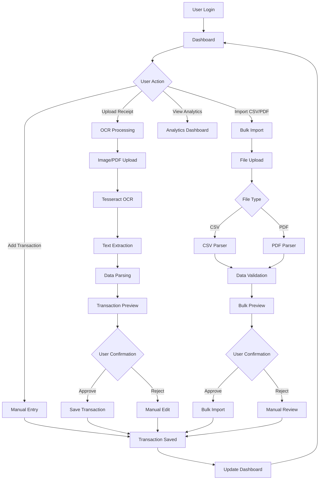
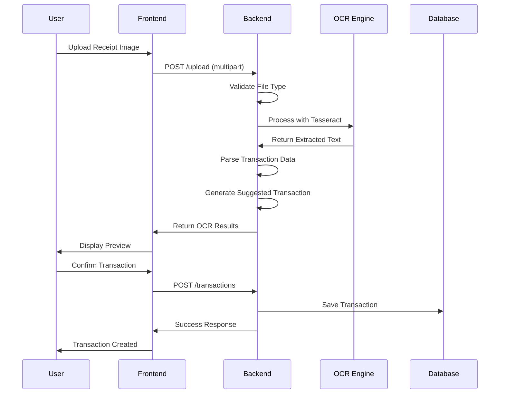

# Personal Finance Assistant

A comprehensive personal finance management application with OCR receipt processing, transaction tracking, and financial analytics.

## 🚀 Features

### Core Features
- **User Authentication & Authorization** - Secure login/register system
- **Transaction Management** - Add, edit, delete, and categorize transactions
- **OCR Receipt Processing** - Upload receipts and automatically extract transaction data
- **CSV/PDF Import** - Bulk import transactions from bank statements
- **Financial Analytics** - Comprehensive spending analysis and insights
- **Budget Tracking** - Set and monitor monthly budgets
- **Category Management** - Customize transaction categories
- **Responsive Design** - Works seamlessly on desktop and mobile

### OCR & File Upload Features
- **Multi-format Support**: JPG, PNG, GIF, PDF, CSV
- **Receipt OCR**: Extract transaction details from receipt images
- **PDF Processing**: Parse transaction history from PDF statements
- **CSV Import**: Bulk import from bank CSV exports
- **Real-time Processing**: Live upload progress and status updates
- **Preview Mode**: Review extracted data before importing

## 🛠️ Technology Stack

### Frontend
- **React.js** - Modern UI framework
- **Bootstrap 5** - Responsive design system
- **Bootstrap Icons** - Icon library
- **Axios** - HTTP client
- **React Router** - Navigation

### Backend
- **Node.js** - Runtime environment
- **Express.js** - Web framework
- **MongoDB** - Database
- **Mongoose** - ODM for MongoDB
- **JWT** - Authentication
- **Multer** - File upload handling
- **Tesseract.js** - OCR processing
- **PDF-parse** - PDF text extraction
- **CSV-parser** - CSV file parsing

## 📋 Prerequisites

- Node.js (v14 or higher)
- MongoDB (v4.4 or higher)
- npm or yarn

## 🚀 Installation

### 1. Clone the Repository
```bash
git clone <repository-url>
cd personal-finance-assistant
```

### 2. Install Dependencies

#### Backend
```bash
cd backend
npm install
```

#### Frontend
```bash
cd frontend
npm install
```

### 3. Environment Setup

Create `.env` file in the backend directory:
```env
MONGODB_URI=mongodb://localhost:27017/finance-tracker
JWT_SECRET=your-secret-key
PORT=5000
NODE_ENV=development
```

### 4. Start the Application

#### Development Mode
```bash
# Terminal 1 - Backend
cd backend
npm run dev

# Terminal 2 - Frontend
cd frontend
npm start
```

#### Production Mode
```bash
# Backend
cd backend
npm start

# Frontend
cd frontend
npm run build
```

## 📁 Project Structure

```
personal-finance-assistant/
├── backend/
│   ├── models/
│   │   ├── Transaction.js
│   │   ├── User.js
│   │   └── Category.js
│   ├── routes/
│   │   ├── auth.js
│   │   ├── transactions.js
│   │   ├── upload.js
│   │   └── categories.js
│   ├── middleware/
│   │   └── auth.js
│   ├── uploads/
│   ├── server.js
│   └── package.json
├── frontend/
│   ├── src/
│   │   ├── components/
│   │   ├── contexts/
│   │   ├── pages/
│   │   │   ├── DashboardPage.js
│   │   │   ├── UploadPage.js
│   │   │   ├── TransactionsPage.js
│   │   │   ├── AnalyticsPage.js
│   │   │   ├── ProfilePage.js
│   │   │   ├── LoginPage.js
│   │   │   └── RegisterPage.js
│   │   ├── App.js
│   │   ├── index.js
│   │   └── index.css
│   └── package.json
└── README.md
```

## 🔄 Application Workflow



## 📊 OCR Processing Workflow



## 📁 File Upload Features

### Supported Formats
- **Images**: JPG, JPEG, PNG, GIF
- **Documents**: PDF
- **Data**: CSV

### OCR Processing
- **Receipt Images**: Automatic text extraction and transaction parsing
- **PDF Receipts**: Text extraction from PDF receipts
- **PDF Statements**: Transaction history parsing from bank statements
- **CSV Files**: Direct import of transaction data

### Processing Steps
1. **File Validation**: Check file type and size (max 10MB)
2. **Upload Processing**: Secure file upload with progress tracking
3. **Content Analysis**: Determine file type and processing method
4. **Data Extraction**: OCR for images, text parsing for PDFs, CSV parsing
5. **Data Validation**: Verify extracted information
6. **Preview Generation**: Show user extracted data for confirmation
7. **Transaction Creation**: Save confirmed transactions to database

## 🎨 UI/UX Features

### Modern Design
- **Responsive Layout**: Works on all device sizes
- **Dark/Light Themes**: Customizable appearance
- **Smooth Animations**: Enhanced user experience
- **Intuitive Navigation**: Easy-to-use interface

### Dashboard Features
- **Financial Overview**: Income, expenses, net income, savings rate
- **Recent Transactions**: Quick view of latest activity
- **Budget Progress**: Visual budget tracking
- **Quick Actions**: Fast access to common tasks

### Upload Interface
- **Drag & Drop**: Easy file upload
- **Progress Tracking**: Real-time upload status
- **File Preview**: Show uploaded files
- **OCR Results**: Display extracted data
- **Bulk Import**: Handle multiple transactions

## 🔒 Security Features

- **JWT Authentication**: Secure user sessions
- **Password Hashing**: Bcrypt encryption
- **File Validation**: Secure file uploads
- **Input Sanitization**: Prevent injection attacks
- **Rate Limiting**: Protect against abuse

## 📈 Analytics Features

- **Spending Analysis**: Category-wise breakdown
- **Income Tracking**: Revenue analysis
- **Budget Monitoring**: Progress tracking
- **Trend Analysis**: Historical data visualization
- **Export Capabilities**: Data export functionality

## 🚀 API Endpoints

### Authentication
- `POST /auth/register` - User registration
- `POST /auth/login` - User login
- `GET /auth/profile` - Get user profile

### Transactions
- `GET /transactions` - Get transactions
- `POST /transactions` - Create transaction
- `PUT /transactions/:id` - Update transaction
- `DELETE /transactions/:id` - Delete transaction
- `POST /transactions/bulk` - Bulk import

### Upload & OCR
- `POST /upload` - Upload and process files
- `POST /upload/receipt` - Process receipt images
- `POST /upload/transactions-pdf` - Process PDF statements

### Analytics
- `GET /transactions/analytics/summary` - Financial summary
- `GET /transactions/analytics/categories` - Category analysis
- `GET /transactions/analytics/trends` - Trend analysis

## 🧪 Testing

### Backend Testing
```bash
cd backend
npm test
```

### Frontend Testing
```bash
cd frontend
npm test
```

## 🚀 Deployment

### Backend Deployment
```bash
cd backend
npm run build
npm start
```

### Frontend Deployment
```bash
cd frontend
npm run build
# Deploy build folder to your hosting service
```

## 🤝 Contributing

1. Fork the repository
2. Create a feature branch (`git checkout -b feature/amazing-feature`)
3. Commit your changes (`git commit -m 'Add amazing feature'`)
4. Push to the branch (`git push origin feature/amazing-feature`)
5. Open a Pull Request

## 📝 License

This project is licensed under the MIT License - see the [LICENSE](LICENSE) file for details.

## 🆘 Support

For support, email support@finance-assistant.com or create an issue in the repository.

## 🔄 Version History

- **v1.0.0** - Initial release with basic transaction management
- **v1.1.0** - Added OCR functionality and file upload
- **v1.2.0** - Enhanced UI/UX and analytics features
- **v1.3.0** - Added CSV/PDF import and improved dashboard

---

**Built with ❤️ using React, Node.js, and MongoDB**