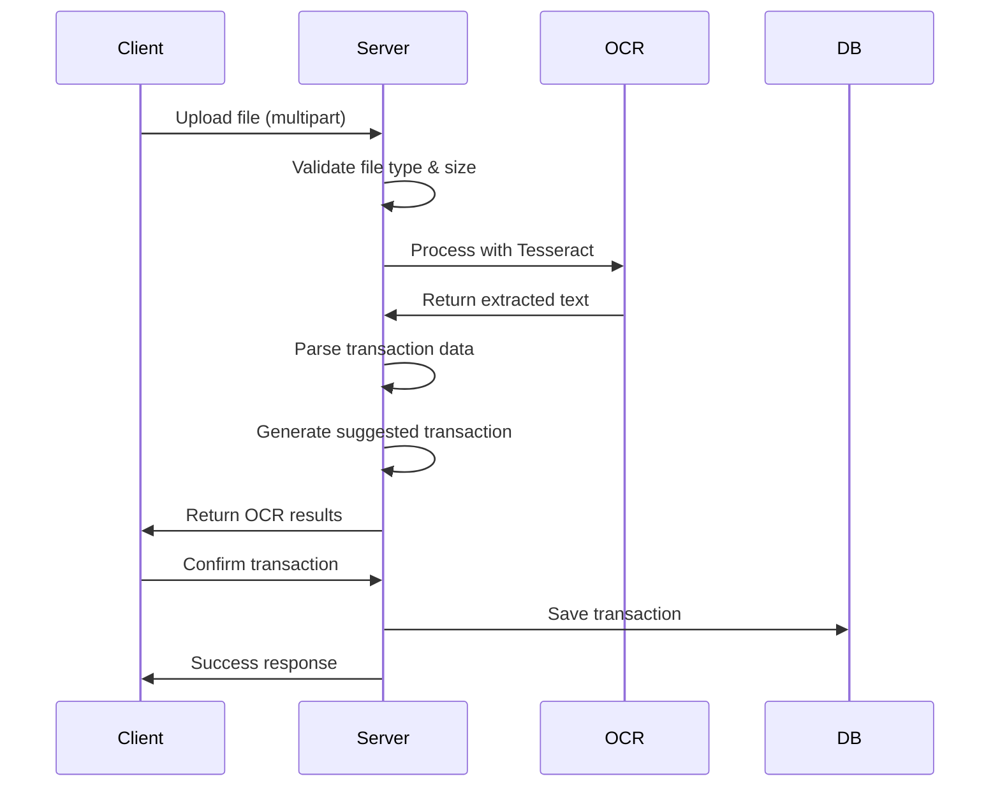

# Personal Finance Assistant - Setup Guide

This guide provides detailed instructions for setting up the Personal Finance Assistant application with OCR functionality and all features.

## 🚀 Quick Start

### Prerequisites
- **Node.js** (v14 or higher)
- **MongoDB** (v4.4 or higher)
- **npm** or **yarn** package manager

### 1. Clone and Install

```bash
# Clone the repository
git clone <repository-url>
cd personal-finance-assistant

# Install backend dependencies
cd backend
npm install

# Install frontend dependencies
cd ../frontend
npm install
```

### 2. Environment Configuration

Create `.env` file in the `backend` directory:

```env
# Server Configuration
PORT=5000
NODE_ENV=development

# Database Configuration
MONGODB_URI=mongodb://localhost:27017/finance-tracker

# JWT Configuration
JWT_SECRET=your-super-secret-jwt-key-change-this-in-production

# File Upload Configuration
MAX_FILE_SIZE=10485760
UPLOAD_PATH=./uploads

# OCR Configuration
TESSERACT_LANG=eng
OCR_CONFIDENCE_THRESHOLD=0.7
```

### 3. Database Setup

#### Local MongoDB
```bash
# Start MongoDB service
mongod

# Or using Docker
docker run -d -p 27017:27017 --name mongodb mongo:latest
```

#### MongoDB Atlas (Cloud)
1. Create account at [MongoDB Atlas](https://www.mongodb.com/atlas)
2. Create a new cluster
3. Get connection string
4. Update `MONGODB_URI` in `.env`

### 4. Start the Application

#### Development Mode
```bash
# Terminal 1 - Backend
cd backend
npm run dev

# Terminal 2 - Frontend
cd frontend
npm start
```

#### Production Mode
```bash
# Backend
cd backend
npm start

# Frontend
cd frontend
npm run build
npm install -g serve
serve -s build -l 3000
```

## 📁 Project Structure

```
personal-finance-assistant/
├── backend/
│   ├── models/
│   │   ├── Transaction.js      # Transaction data model
│   │   ├── User.js            # User data model
│   │   └── Category.js        # Category data model
│   ├── routes/
│   │   ├── auth.js            # Authentication routes
│   │   ├── transactions.js    # Transaction CRUD routes
│   │   ├── upload.js          # File upload & OCR routes
│   │   └── categories.js      # Category management routes
│   ├── middleware/
│   │   └── auth.js            # JWT authentication middleware
│   ├── uploads/               # Temporary file storage
│   ├── server.js              # Express server setup
│   └── package.json           # Backend dependencies
├── frontend/
│   ├── src/
│   │   ├── components/        # Reusable React components
│   │   ├── contexts/          # React context providers
│   │   ├── pages/             # Page components
│   │   │   ├── DashboardPage.js
│   │   │   ├── UploadPage.js
│   │   │   ├── TransactionsPage.js
│   │   │   ├── AnalyticsPage.js
│   │   │   ├── ProfilePage.js
│   │   │   ├── LoginPage.js
│   │   │   └── RegisterPage.js
│   │   ├── App.js             # Main app component
│   │   ├── index.js           # React entry point
│   │   └── index.css          # Global styles
│   └── package.json           # Frontend dependencies
└── README.md                  # Project documentation
```

## 🔧 OCR Configuration

### Tesseract.js Setup

The application uses Tesseract.js for OCR processing. The setup is automatic, but you can configure:

```javascript
// In backend/routes/upload.js
const { data: { text } } = await Tesseract.recognize(imagePath, 'eng', {
  logger: m => console.log(m),
  // Additional options
  tessedit_char_whitelist: '0123456789ABCDEFGHIJKLMNOPQRSTUVWXYZabcdefghijklmnopqrstuvwxyz.,$ ',
  preserve_interword_spaces: '1'
});
```

### Supported File Formats

#### Images (OCR Processing)
- **JPG/JPEG**: Receipt photos
- **PNG**: Screenshots, scanned receipts
- **GIF**: Animated receipts (first frame processed)

#### Documents (Text Extraction)
- **PDF**: Receipts and bank statements
- **CSV**: Transaction data import

### File Size Limits
- **Maximum**: 10MB per file
- **Recommended**: 2-5MB for optimal OCR performance

## 📊 Database Models

### User Model
```javascript
{
  _id: ObjectId,
  name: String,
  email: String,
  password: String (hashed),
  currency: String (default: 'USD'),
  monthlyBudget: Number,
  createdAt: Date,
  updatedAt: Date
}
```

### Transaction Model
```javascript
{
  _id: ObjectId,
  user: ObjectId (ref: 'User'),
  type: String ('income' | 'expense'),
  amount: Number,
  description: String,
  category: String,
  date: Date,
  paymentMethod: String,
  createdAt: Date,
  updatedAt: Date
}
```

### Category Model
```javascript
{
  _id: ObjectId,
  name: String,
  type: String ('income' | 'expense'),
  color: String,
  icon: String,
  user: ObjectId (ref: 'User'),
  createdAt: Date
}
```

## 🔄 API Workflow

### OCR Processing Flow



### File Upload Process

1. **File Validation**
   - Check file type (JPG, PNG, PDF, CSV)
   - Verify file size (max 10MB)
   - Validate file integrity

2. **Content Processing**
   - **Images**: OCR text extraction
   - **PDFs**: Text extraction + parsing
   - **CSV**: Direct data parsing

3. **Data Extraction**
   - Parse amounts, dates, descriptions
   - Identify transaction type (income/expense)
   - Extract merchant information

4. **Preview Generation**
   - Show extracted data to user
   - Allow manual corrections
   - Confirm before saving

## 🎨 UI Customization

### CSS Variables
```css
:root {
  --primary-color: #28a745;
  --primary-dark: #1e7e34;
  --secondary-color: #6c757d;
  --success-color: #28a745;
  --danger-color: #dc3545;
  --warning-color: #ffc107;
  --info-color: #17a2b8;
  --border-radius: 10px;
  --box-shadow: 0 2px 10px rgba(0, 0, 0, 0.1);
  --transition: all 0.3s ease;
}
```

### Theme Customization
```javascript
// In frontend/src/contexts/ThemeContext.js
const themes = {
  light: {
    background: '#f8f9fa',
    text: '#343a40',
    primary: '#28a745'
  },
  dark: {
    background: '#343a40',
    text: '#f8f9fa',
    primary: '#28a745'
  }
};
```

## 🔒 Security Configuration

### JWT Configuration
```javascript
// In backend/middleware/auth.js
const jwt = require('jsonwebtoken');

const generateToken = (userId) => {
  return jwt.sign({ userId }, process.env.JWT_SECRET, {
    expiresIn: '7d'
  });
};
```

### File Upload Security
```javascript
// In backend/routes/upload.js
const fileFilter = (req, file, cb) => {
  const allowedTypes = [
    'image/jpeg', 'image/png', 'image/gif',
    'application/pdf', 'text/csv'
  ];
  
  if (allowedTypes.includes(file.mimetype)) {
    cb(null, true);
  } else {
    cb(new Error('Invalid file type'), false);
  }
};
```

## 📈 Performance Optimization

### Backend Optimizations
```javascript
// Enable compression
app.use(compression());

// Rate limiting
const rateLimit = require('express-rate-limit');
app.use('/api/', rateLimit({
  windowMs: 15 * 60 * 1000, // 15 minutes
  max: 100 // limit each IP to 100 requests per windowMs
}));

// Caching headers
app.use((req, res, next) => {
  res.set('Cache-Control', 'public, max-age=300');
  next();
});
```

### Frontend Optimizations
```javascript
// Lazy loading components
const LazyComponent = React.lazy(() => import('./Component'));

// Image optimization

```

## 🧪 Testing Setup

### Backend Testing
```bash
cd backend
npm install --save-dev jest supertest
npm test
```

### Frontend Testing
```bash
cd frontend
npm install --save-dev @testing-library/react @testing-library/jest-dom
npm test
```

### Test Configuration
```javascript
// jest.config.js
module.exports = {
  testEnvironment: 'jsdom',
  setupFilesAfterEnv: ['<rootDir>/src/setupTests.js'],
  moduleNameMapping: {
    '\\.(css|less|scss|sass)$': 'identity-obj-proxy'
  }
};
```

## 🚀 Deployment

### Backend Deployment (Heroku)
```bash
# Create Heroku app
heroku create your-finance-app

# Set environment variables
heroku config:set MONGODB_URI=your-mongodb-uri
heroku config:set JWT_SECRET=your-jwt-secret

# Deploy
git push heroku main
```

### Frontend Deployment (Netlify)
```bash
# Build the app
npm run build

# Deploy to Netlify
netlify deploy --prod --dir=build
```

### Environment Variables for Production
```env
NODE_ENV=production
MONGODB_URI=your-production-mongodb-uri
JWT_SECRET=your-production-jwt-secret
PORT=5000
```

## 🔧 Troubleshooting

### Common Issues

#### OCR Not Working
```bash
# Check Tesseract installation
npm list tesseract.js

# Verify file permissions
chmod 755 uploads/

# Check file size limits
# Increase if needed in multer config
```

#### Database Connection Issues
```bash
# Check MongoDB status
sudo systemctl status mongod

# Verify connection string
mongo "mongodb://localhost:27017/finance-tracker"

# Check network connectivity
ping your-mongodb-host
```

#### File Upload Errors
```bash
# Check upload directory permissions
ls -la uploads/

# Verify file size limits
# Check multer configuration

# Test with smaller files first
```

### Debug Mode
```javascript
// Enable debug logging
const debug = require('debug')('finance-app:*');

// Add to your routes
app.use((req, res, next) => {
  debug(`${req.method} ${req.url}`);
  next();
});
```

## 📚 Additional Resources

- [Tesseract.js Documentation](https://tesseract.projectnaptha.com/)
- [MongoDB Atlas Setup](https://docs.atlas.mongodb.com/)
- [Express.js Best Practices](https://expressjs.com/en/advanced/best-practices-performance.html)
- [React Performance Optimization](https://reactjs.org/docs/optimizing-performance.html)

## 🤝 Support

For additional support:
- Create an issue in the repository
- Check the troubleshooting section
- Review the API documentation
- Contact the development team

---

**Happy Coding! 🚀**